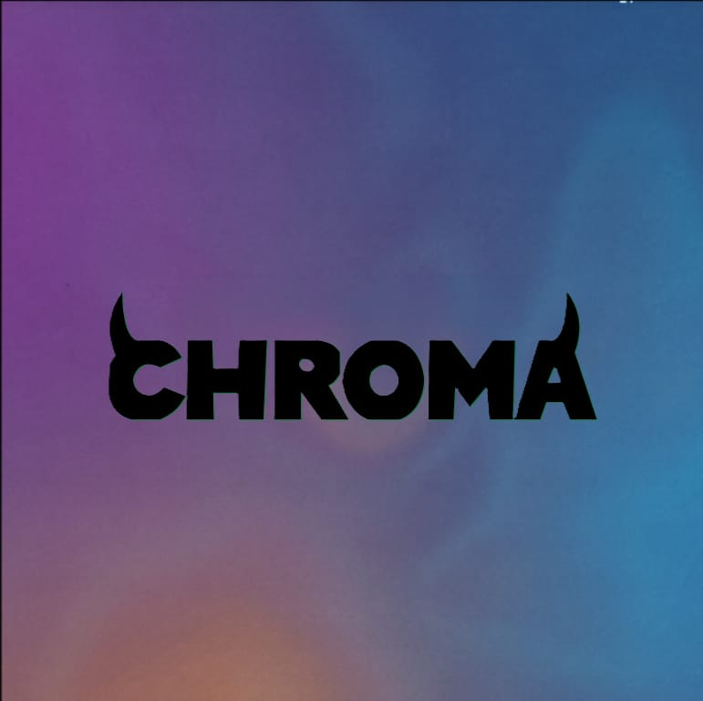

# CHROMA



## Overview

**Chroma** is a command-line tool for generating documentation using AI. It is designed to automate the process of creating well-structured and insightful documentation for your projects, powered by **Mistral AI Codestral**.

## Features

- **Markdown Documentation**: Generate comprehensive markdown documentation from source files.
- **Inline Documentation**: Automatically add AI-generated comments to your code.
- **Starlight Documentation Site**: Convert your project's documentation into a **Starlight-powered** website.
- **Configuration Management**: Easily configure API credentials.
- **Live Preview**: Start a local server to preview the documentation site.

## Installation

Ensure you have **Go** installed on your system. Then, clone the repository and build the binary:

```sh
# Clone the repository
git clone https://github.com/chachacollins/chroma.git
cd chroma

# Build the binary
go build -o chroma

# Move the binary to a directory in your PATH
mv chroma /usr/local/bin/
```

Pre-built binaries for **Windows** and **Linux** are available on the [Releases](https://github.com/chachacollins/chroma/releases) page.

## Usage

### 1. Generate Markdown Documentation
```sh
chroma md <input-file> <output-file>
```
**Example:**
```sh
chroma md main.go api.md
```
This will generate a markdown documentation file (`api.md`) based on the provided Go source file (`main.go`).

### 2. Add Inline Documentation
```sh
chroma il <file>
```
**Example:**
```sh
chroma il main.go
```
This command will analyze `main.go` and inject AI-generated documentation comments.

### 3. Generate a Starlight Documentation Site
```sh
chroma star <source-file>
```
**Example:**
```sh
chroma star main.go
```
This will generate a Starlight-powered documentation website inside a `docs` directory.

### 4. Configure API Credentials
```sh
chroma init
```
This will guide you through setting up API credentials required for AI-powered documentation generation.

### 5. Serve Documentation Locally
```sh
chroma serve
```
This will launch a local server (default port `4321`) for previewing your documentation site.

## Dependencies
- **Go** (1.20+)
- **cobra** (Command-line framework)
- **Mistral AI Codestral**
- **Astro Starlight** (For documentation site generation)

## Contributing
Contributions are welcome! Feel free to submit issues or pull requests.

## License
This project is licensed under the **MIT License**.

---

For more details, visit the [GitHub repository](https://github.com/chachacollins/chroma).

